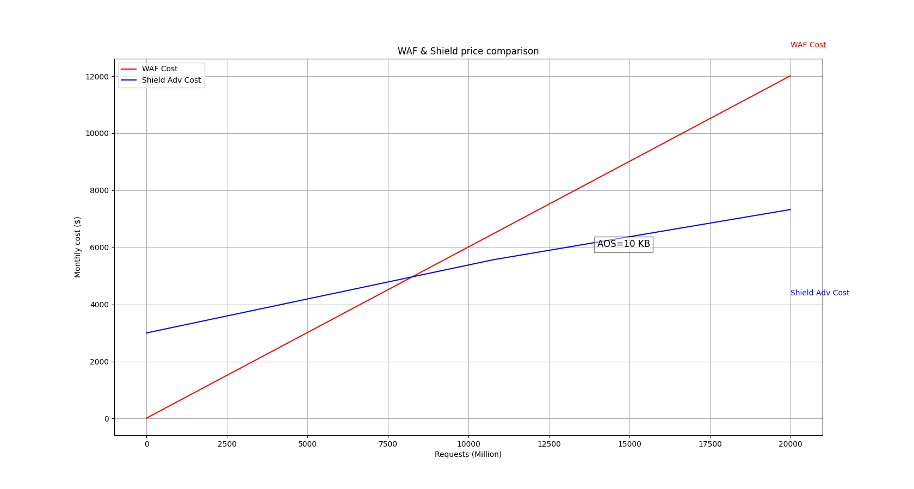
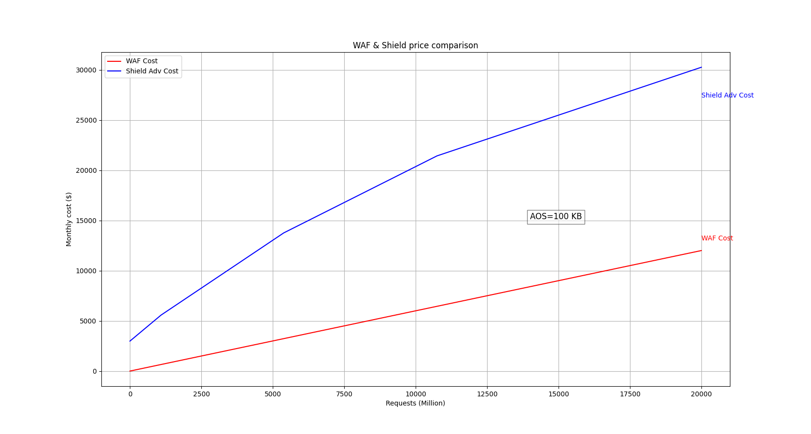

# WAF & Shield Price Comparison

This Python script calculates and plots the monthly costs associated with AWS WAF Only (Web Application Firewall) and AWS Shield Advanced based on the number of requests and data transfer out (DTO). The script considers **standard cost** for WAF and different pricing tiers for Shield Advanced.

## Prerequisites

- Python 3.x
- NumPy
- Matplotlib

## Installation

1. Install Python 3.x if you haven't already. You can download it from the [official Python website](https://www.python.org/downloads/).
2. Install the required Python packages using pip:
    ```bash
    pip install -r requirements.txt
    ```

## Usage

1. Change the value of `AOS` (Average Object Size in KB) based on your actual situation.
2. Run the script using Python:
    ```bash
    python main.py
    ```

## Script Details

### Other constants

- `WEBACL_NUM`: Number of Web ACLs.
- `RULE_NUM`: Number of rules.
- `REQ_PRICE`: Cost per million requests for WAF.
- `SUBSC`: Monthly subscription fee for Shield Advanced.
- `TIER1_LIMIT`, `TIER2_LIMIT`, `TIER3_LIMIT`: Limits for Shield pricing tiers in GB.
- `TIER1_PRICE`, `TIER2_PRICE`, `TIER3_PRICE`, `TIER4_PRICE`: Prices per GB for Shield Advanced.

All default pricing value is for Amazon CloudFront. You may find more details at [AWS WAF Pricing](https://aws.amazon.com/waf/pricing/) and [AWS Shield Pricing](https://aws.amazon.com/shield/pricing/).

### Calculations

1. **WAF Monthly Fee**:
    - Calculated as the sum of Web ACL costs, rule costs, and the cost per million requests.

2. **Shield Monthly DTO**:
    - Calculated based on the Average Object Size and the number of requests.

3. **Shield Monthly Fee**:
    - Calculated using different pricing tiers.

### Plotting

- The script plots two lines:
    - Red line: Represents WAF cost.
    - Blue line: Represents Shield Advanced cost.
- The plot includes a legend and grid for better readability.
- An annotation is added to display the Average Object Size (AOS) on the plot.

## Example Output

The script generates a plot comparing the monthly costs of AWS WAF and AWS Shield Advanced based on the number of requests.

### WAF & Shield Price Comparison > AOS=10KB


### WAF & Shield Price Comparison > AOS=100KB


## License

This project is licensed under the MIT License. See the [LICENSE](LICENSE) file for details.